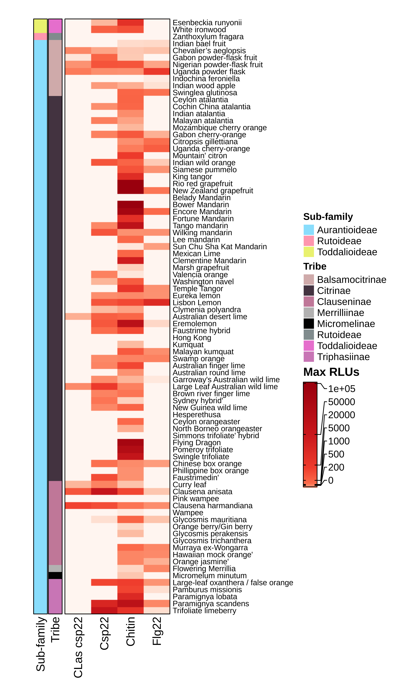
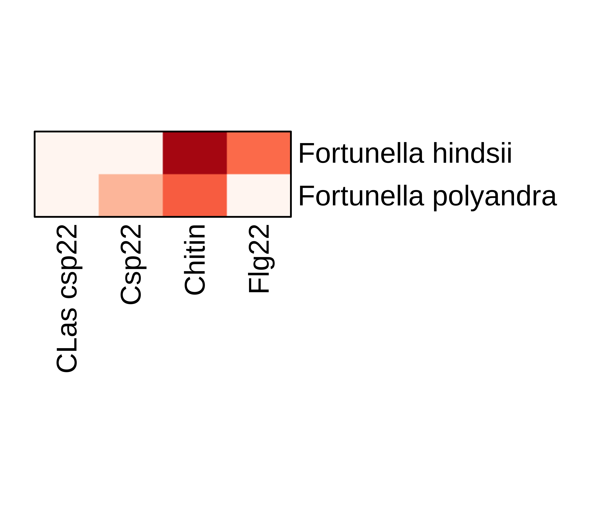
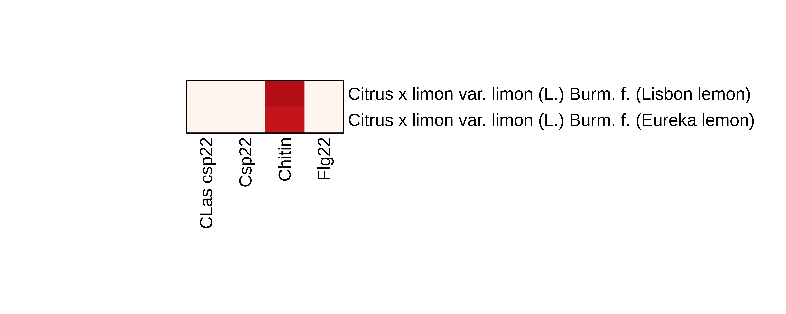
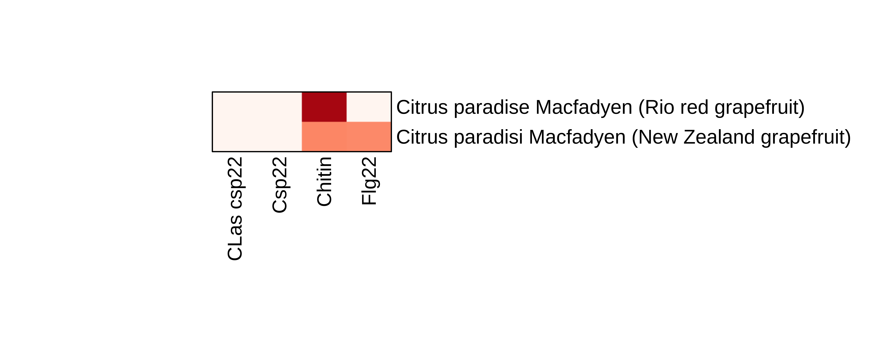

#### library packages need to load

```{r}
library(RColorBrewer)
library(devtools)
library(ComplexHeatmap)
library(readxl)
library(circlize)
library(treemap)
library(data.tree)
library(stringr)
library(ggplot2)
library(patchwork)
library(reshape2)

```
NOTE: I have had issues sometimes loading the complex heatmap package (not sure why), 
Try one of the many ways to download the package and if still running into troubles,
consult google or contact me

install_github("jokergoo/ComplexHeatmap")
devtools::install_github("jokergoo/ComplexHeatmap")
if (!requireNamespace("BiocManager", quietly=TRUE))
install.packages("BiocManager")
BiocManager::install("ComplexHeatmap")


#### Load Processed Data and Colors


```{r}
#make sure to set path to the same place where the figure 
source("./Process_PAMP_responses.R")


source("./Figure_colors.R")
```

#### row name settings


```{r}
#collect row nameinformation annotation - common name + botanical name
row_names_to_apply <- filtered_avg_PAMP_response$`Common name`
for (i in 1:length(row_names_to_apply)){
  if(row_names_to_apply[i] == "0"){
    row_names_to_apply[i] <- filtered_avg_PAMP_response$`Botanical name`[i]
  }
}
row.names(melted_filtered_avg_PAMP_responses) <- row_names_to_apply
```


#### settings for inital response - color code

```{r}
#create a customs scale to take in differential responses
my_scale_breaks <- c(0,200, 500, 1000, 5000, 20000, 50000, 100000)
colors <- RColorBrewer::brewer.pal(length(my_scale_breaks), "Reds")
my_color_scale_breaks <- circlize::colorRamp2(my_scale_breaks, colors)


##pull out row names to annotate with
citrus_realtionship_info <- filtered_avg_PAMP_response[,2:3]
citrus_realtionship_info_simplified <- citrus_realtionship_info[!duplicated(citrus_realtionship_info[,1:2]),]


#need to determine color codes
a <- unique(citrus_realtionship_info_simplified$`Sub-family`)
b <- unique(citrus_realtionship_info_simplified$Tribe)
b <- b[!b %in% a]

col1_only <- RColorBrewer::brewer.pal(length(a), "Pastel1")
col2_only <- RColorBrewer::brewer.pal(length(b), "Pastel2")

col1 <- setNames(RColorBrewer::brewer.pal(length(a), "Pastel1"), a)
col2 <- setNames(RColorBrewer::brewer.pal(length(b), "Pastel2"), b)
col2 <- append(col2,  col1)
col.list <- list(a = col1, b = col2)

col_list_ht <- circlize::colorRamp2(append(a,b),append(col1_only,col2_only))
```


#### plot heatmap max rlu 


```{r}
png("Heatmap_plot_all_values_v2.png", units="in", width=8, height=10, res=800)

row_anno <- rowAnnotation(df = citrus_realtionship_info,
                          col = col.list, 
                          border = TRUE)


ht = ComplexHeatmap::Heatmap(melted_filtered_avg_PAMP_responses,
                             
                             #cluster color modificaiton
                             col = my_color_scale_breaks,
                             
                             #column modifications
                             cluster_columns = F,
                             cluster_rows = F,
                             
                             #row modifications + dendrogram
                             show_row_names = T,
                             row_names_gp = gpar(fontsize = 8),
                             
                             
                             #row_dend_width = unit(30, "mm"),
                             #row_split = filtered_avg_PAMP_response$Tribe, #manual row split
                             #cluster_row_slices = T,
                             #row_dend_reorder = T,
                             
                             #sizing and border
                             border = T,
                             width = unit(1.5, "in"),
                             height = unit(8.5, "in"),
                             
                             #annotate Taxnonomy Info
                             left_annotation = row_anno,
                             
                             #details regarding modifying legend
                             heatmap_legend_param = list(col_fun = my_color_scale_breaks, 
                                                         legend_width = unit(35, "mm"),
                                                         legend_height = unit(38, "mm"),
                                                         title = "Max RLUs", 
                                                         border = "black",
                                                         at = my_scale_breaks,
                                                         title_gp = gpar(fontsize = 12, fontface = "bold", fontfamily = "Arial"),
                                                         labels_gp = gpar(fontsize = 10,fontfamily = "Arial"),
                                                         grid_width = unit(0.5, "cm"),
                                                         legend_label_gp = gpar(col = "black",fontsize = 10, fontfamily = "Arial")),
                             
                             use_raster = TRUE, raster_quality = 2) 


draw(ht, heatmap_legend_side = "left")

dev.off()


```



#### plot indivisdial values - heatmap

```{r}
#row names just botanical information
row.names(melted_filtered_avg_PAMP_responses) <- filtered_avg_PAMP_response$`Botanical name`

###create function to create automated ploting
Small_subset_heatmap <- function(matrix_in){
  
  #determine height of image
  number_of_samples <- nrow(matrix_in)
  height_of_heatmap <- number_of_samples*0.25
  
  #determine width of image
  #max_char_length <- max(nchar(row.names(matrix_in)))
  
  hold_ht = ComplexHeatmap::Heatmap(matrix_in,
                                    #cluster color modificaiton
                                    col = my_color_scale_breaks,
                                    show_heatmap_legend = c(col = FALSE),
                                    
                                    #column modifications
                                    cluster_columns = F,
                                    cluster_rows = F,
                                    
                                    #row modifications + dendrogram
                                    show_row_names = T,
                                    row_names_gp = gpar(fontsize = 12),
                                    
                                    #sizing and border
                                    border = T,
                                    width = unit(1.5, "in"),
                                    height = unit(height_of_heatmap, "in"),
                                    use_raster = TRUE, raster_quality = 2)
  
}

```

```{r}
#subsetting Kumquats
Kumquats <- c("Fortunella margarita","Fortunella hindsii","Fortunella polyandra")
Kumquats_melt <- melted_filtered_avg_PAMP_responses[row.names(melted_filtered_avg_PAMP_responses) %in% Kumquats,]

#png("Kumquats_heatmap_subset.png", height = 3, width = 3.5, units = "in", res = 1200)
Kumquats_ht<- Small_subset_heatmap(Kumquats_melt)
Kumquats_ht
#dev.off()
```

```{r}
#Subsetting Micrantha
Micrantha <- c("Citrus micrantha"," Citrus micrantha var. microcarpa")
Micrantha_melt <- melted_filtered_avg_PAMP_responses[row.names(melted_filtered_avg_PAMP_responses) %in% Micrantha,]

#png("Micrantha_heatmap_subset.png", height = 3, width = 3.5, units = "in", res = 1200)
Micrantha_ht <- Small_subset_heatmap(Micrantha_melt)
Micrantha_ht
#dev.off()
```

```{r}
#Subsetting Lemon
Lemon <- c("Citrus x limon var. limon (L.) Burm. f. (Lisbon lemon)","Citrus x limon var. limon (L.) Burm. f. (Eureka lemon)")
Lemon_melt <- melted_filtered_avg_PAMP_responses[row.names(melted_filtered_avg_PAMP_responses) %in% Lemon,]

#png("Lemon_heatmap_subset.png", height = 3, width = 7.5, units = "in", res = 1200)
Lemon_ht <- Small_subset_heatmap(Lemon_melt)
Lemon_ht
#dev.off()
```

```{r}
#Subsetting Grapefruit
Grapefruit <- c("Citrus paradisi Macfadyen (Marsh grapefruit)",
                "Citrus paradise Macfadyen (Rio red grapefruit)",
                "Citrus paradisi Macfadyen (New Zealand grapefruit)")

Grapefruit_melt <-  melted_filtered_avg_PAMP_responses[row.names(melted_filtered_avg_PAMP_responses) %in% Grapefruit,]

#png("Grapefruit_heatmap_subset.png", height = 3, width = 7.5, units = "in", res = 1200)
Grapefruit_ht <- Small_subset_heatmap(Grapefruit_melt)
Grapefruit_ht
#dev.off()
```






#### plot indivisdial values - boxplot? for each tribe data set

```{r}

Toddalioideae_melt <- reshape2::melt(Toddalioideae)
Toddalioideae_box <- ggplot(Toddalioideae_melt, aes(x = variable, y = value, fill = `Sub-family`)) +
  geom_boxplot() +
  geom_jitter(aes(colour = `Sub-family`), size = 1.5, alpha = 0.8, width= 0.2, colour = "black") +
  theme_bw() +
  ylab("Max RLUs") + 
  xlab("") +
  scale_y_log10() +
  theme(legend.position = "none")+
  scale_fill_manual("Sub-Family", values = col.list$a)+
  scale_colour_manual("Sub-Family", values = col.list$a) +
  labs(subtitle = c(as.character(unique(Toddalioideae_melt$Tribe))))


Balsamocitrinae_melt <- reshape2::melt(Balsamocitrinae)
Balsamocitrinae_box <- ggplot(Balsamocitrinae_melt, aes(x = variable, y = value, fill = Tribe)) +
  geom_boxplot(alpha = 0.5) +
  geom_jitter(aes(color = Tribe), size = 1.5, alpha = 0.8, width= 0.2, colour = "black") +
  theme_bw() +
  ylab("Max RLUs") +
  xlab("") +
  scale_y_log10() +
  theme(legend.position = "none")+
  scale_fill_manual("Tribe", values = col.list$b) +
  scale_colour_manual("Tribe", values = col.list$b) +
  labs(subtitle = c(as.character(unique(Balsamocitrinae_melt$Tribe))))


Citrinae_melt <- reshape2::melt(Citrinae)
Citrinae_box <- ggplot(Citrinae_melt, aes(x = variable, y = value, fill = Tribe)) +
  geom_boxplot(alpha = 0.5) +
  geom_jitter(aes(color = Tribe), size = 1.5, alpha = 0.8, width= 0.2, colour = "black") +
  theme_bw() +
  ylab("Max RLUs") + 
  xlab("") +
  scale_y_log10() +
  theme(legend.position = "none")+
  scale_fill_manual("Tribe", values = col.list$b) +
  scale_colour_manual("Tribe", values = col.list$b) +
  labs(subtitle = c(as.character(unique(Citrinae_melt$Tribe))))


Clauseninae_melt <- reshape2::melt(Clauseninae)
Clauseninae_box <- ggplot(Clauseninae_melt, aes(x = variable, y = value, fill = Tribe)) +
  geom_boxplot(alpha = 0.5) +
  geom_jitter(aes(color = Tribe), size = 1.5, alpha = 0.8, width= 0.2, colour = "black") +
  theme_bw() +
  ylab("Max RLUs") + 
  xlab("") +
  scale_y_log10() +
  theme(legend.position = "none")+
  scale_fill_manual("Tribe", values = col.list$b) +
  scale_colour_manual("Tribe", values = col.list$b) +
  labs(subtitle = c(as.character(unique(Clauseninae_melt$Tribe))))


Triphasiinae_melt <- reshape2::melt(Triphasiinae)
Triphasiinae_box <- ggplot(Triphasiinae_melt, aes(x = variable, y = value, fill = Tribe)) +
  geom_boxplot(alpha = 0.5) +
  geom_jitter(aes(color = Tribe), size = 1.5, alpha = 0.8, width= 0.2, colour = "black") +
  theme_bw() +
  ylab("Max RLUs") + 
  xlab("") +
  scale_y_log10() +
  theme(legend.position = "none")+
  scale_fill_manual("Tribe", values = col.list$b) +  
  scale_colour_manual("Tribe", values = col.list$b) +
  labs(subtitle = c(as.character(unique(Triphasiinae_melt$Tribe))))


png("Comparison_of_Max_RLUs_across_Tribes.png", height = 8, width = 3.5, units = "in", res = 800)
Toddalioideae_box/Balsamocitrinae_box/Citrinae_box/Clauseninae_box/Triphasiinae_box
dev.off()

```


#### plot degress of variation


```{r}
degree_of_variation_bargraph <- function(data_frame_in){
  reset_data <- reshape2::melt(data_frame_in, id=c("Botanical name",'Sub-family','Tribe','Common name'))
  reset_data$value <- as.factor(reset_data$value)
  ggplot(reset_data, aes(x= variable, fill = value))+
    geom_bar(position = "fill")+
    xlab("")+
    theme_bw() +
    scale_fill_manual("Response", values= color_code_samples_col) +
    labs(subtitle = c(as.character(unique(reset_data$Tribe))))
}
```

```{r}

png("Degress_of_variation_Comparison_of_Max_RLUs_across_Tribes.png", height = 8, width = 3.5, units = "in", res = 800)

(degree_of_variation_bargraph(Toddalioideae_alt)/
    degree_of_variation_bargraph(Rutoideae_alt)/
    
    degree_of_variation_bargraph(Balsamocitrinae_alt)/
    degree_of_variation_bargraph(Citrinae_alt)/
    degree_of_variation_bargraph(Clauseninae_alt)/
    degree_of_variation_bargraph(Merrilliinae_alt)/
    degree_of_variation_bargraph(Micromelinae_alt)/
    degree_of_variation_bargraph(Triphasiinae_alt))
    
    dev.off()
```


